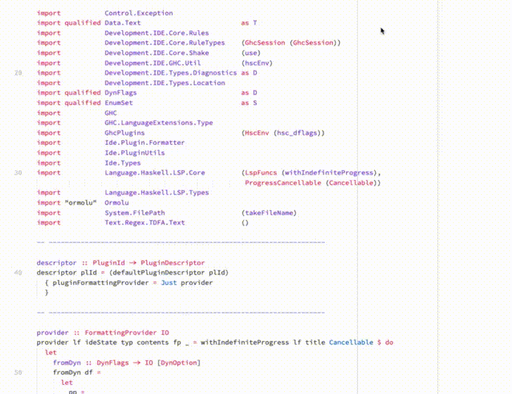
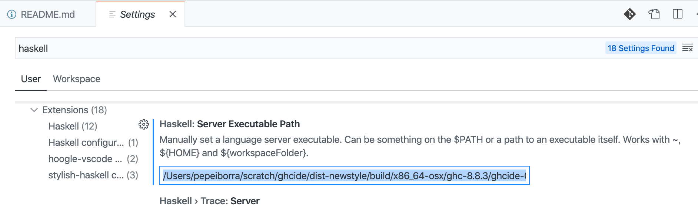

# Let’s write a Haskell Language Server plugin

Originally written by Pepe Iborra, maintained by the Haskell community.

Haskell Language Server (HLS) is a Language Server Protocol (LSP) server for the Haskell programming language. It builds on several previous efforts to create a Haskell IDE.
You can find many more details on the history and architecture on the [IDE 2020](https://mpickering.github.io/ide/index.html) community page.
In this article we are going to cover the creation of an HLS plugin from scratch: a code lens to display explicit import lists.
Along the way we will learn about HLS, its plugin model, and the relationship with [ghcide](https://github.com/haskell/haskell-language-server/tree/master/ghcide) and LSP.

## Introduction

Writing plugins for HLS is a joy. Personally, I enjoy the ability to tap into the gigantic bag of goodies that is GHC, as well as the IDE integration thanks to LSP.

In the last couple of months, I have written various HLS plugins, including:

1. Suggest imports for variables not in scope,
2. Remove redundant imports,
3. Evaluate code in comments (à la [doctest](https://docs.python.org/3/library/doctest.html)),
4. Integrate the [retrie](https://github.com/facebookincubator/retrie) refactoring library.

These plugins are small but meaningful steps towards a more polished IDE experience.
While writing them, I didn't have to worry about performance, UI, or distribution; another tool (usually GHC) always did the heavy lifting.

The plugins also make these tools much more accessible to all users of HLS.

## Preamble

This tutorial is a literate Haskell file that can be compiled.
As such, we list the imports, extensions etc... necessary for compilation.

Please just skip over this `import` section, if you are only interested in the tutorial!

```haskell
{-# LANGUAGE OverloadedStrings #-}
{-# LANGUAGE DerivingStrategies #-}
{-# LANGUAGE ScopedTypeVariables #-}
{-# LANGUAGE RecordWildCards #-}
{-# LANGUAGE NamedFieldPuns #-}
{-# LANGUAGE ViewPatterns #-}
{-# LANGUAGE DeriveGeneric #-}
{-# LANGUAGE DataKinds #-}
{-# LANGUAGE DeriveAnyClass #-}

import Ide.Types
import Ide.Logger
import Ide.Plugin.Error

import Development.IDE.Core.RuleTypes
import Development.IDE.Core.Service hiding (Log)
import Development.IDE.Core.Shake hiding (Log)
import Development.IDE.GHC.Compat
import Development.IDE.GHC.Compat.Core
import Development.IDE.GHC.Error
import Development.IDE.Types.HscEnvEq
import Development.IDE.Core.PluginUtils

import qualified Language.LSP.Server as LSP
import Language.LSP.Protocol.Types as JL
import Language.LSP.Protocol.Message

import Data.Aeson as Aeson
import Data.Map (Map)
import Data.IORef
import Data.Maybe (fromMaybe, catMaybes)
import qualified Data.Map as Map
import qualified Data.HashMap.Strict as HashMap
import qualified Data.Text as T
import Control.Monad (forM)
import Control.Monad.IO.Class (liftIO)
import Control.Monad.Trans.Class
import GHC.Generics (Generic)
```

## Plugins in the HLS codebase

The HLS codebase includes several plugins (found in `./plugins`). For example:

- The `ormolu`, `fourmolu`, `floskell` and `stylish-haskell` plugins used to format code
- The `eval` plugin, a code lens provider to evaluate code in comments
- The `retrie` plugin, a code action provider to execute retrie commands

I recommend looking at the existing plugins for inspiration and reference. A few conventions shared by all plugins are:

- Plugins are in the `./plugins` folder
- Plugins implement their code under the `Ide.Plugin.*` namespace
- Folders containing the plugin follow the `hls-pluginname-plugin` naming convention
- Plugins are "linked" in `src/HlsPlugins.hs#idePlugins`. New plugin descriptors
  must be added there.

  ```haskell ignore
  -- Defined in src/HlsPlugins.**hs**

  idePlugins = pluginDescToIdePlugins allPlugins
    where
      allPlugins =
        [ GhcIde.descriptor "ghcide"
        , Pragmas.descriptor "pragmas"
        , Floskell.descriptor "floskell"
        , Fourmolu.descriptor "fourmolu"
        , Ormolu.descriptor "ormolu"
        , StylishHaskell.descriptor "stylish-haskell"
        , Retrie.descriptor "retrie"
        , Eval.descriptor "eval"
        , NewPlugin.descriptor "new-plugin" -- Add new plugins here.
        ]
  ```

To add a new plugin, extend the list of `allPlugins` and rebuild.

## The goal of the plugin we will write

Here is a visual statement of what we want to accomplish:

   

And here is the gist of the algorithm:

1. Request the type checking artifacts from the `ghcide` subsystem
2. Extract the actual import lists from the type-checked AST
3. Ask GHC to produce the minimal import lists for this AST
4. For every import statement without an explicit import list:
   - Determine the minimal import list
   - Produce a code lens to display it and a command to apply it

## Setup

To get started, fetch the HLS repository and build it by following the [installation instructions](https://haskell-language-server.readthedocs.io/en/latest/contributing/contributing.html#building).

If you run into any issues trying to build the binaries, you can get in touch with the HLS team using one of the [contact channels](https://haskell-language-server.readthedocs.io/en/latest/contributing/contributing.html#how-to-contact-the-haskell-ide-team) or [open an issue](https://github.com/haskell/haskell-language-server/issues) in the HLS repository.

Once the build is done, you can find the location of the HLS binary with `cabal list-bin exe:haskell-language-server` and point your LSP client to it.
This way you can simply test your changes by reloading your editor after rebuilding the binary.

> **Note:** In VSCode, edit the "Haskell Server Executable Path" setting.
>
> **Note:** In Emacs, edit the `lsp-haskell-server-path` variable.



[Manually test your hacked HLS](https://haskell-language-server.readthedocs.io/en/latest/contributing/contributing.html#manually-testing-your-hacked-hls) to ensure you use the HLS package you just built.

## Digression about the Language Server Protocol

There are two main types of communication in the Language Server Protocol:

- A **request-response interaction** type where one party sends a message that requires a response from the other party.
- A **notification** is a one-way interaction where one party sends a message without expecting any response.

> **Note**: The LSP client and server can both send requests or notifications to the other party.

## Anatomy of a plugin

HLS plugins are values of the `PluginDescriptor` datatype, which is defined in `hls-plugin-api/src/Ide/Types.hs` as:

```haskell ignore
data PluginDescriptor (ideState :: Type) =
  PluginDescriptor { pluginId                   :: !PluginId
                   , pluginCommands             :: ![PluginCommand ideState]
                   , pluginHandlers             :: PluginHandlers ideState
                   , pluginNotificationHandlers :: PluginNotificationHandlers ideState
--                 , [...] -- Other fields omitted for brevity.
                   }
```

### Request-response interaction

The `pluginHandlers` handle LSP client requests and provide responses to the client. They must fulfill these requests as quickly as possible.

- Example: When you want to format a file, the client sends the [`textDocument/formatting`](https://microsoft.github.io/language-server-protocol/specifications/lsp/3.17/specification/#textDocument_formatting) request to the server. The server formats the file and responds with the formatted content.

### Notification

The `pluginNotificationHandlers` handle notifications sent by the client to the server that are not explicitly triggered by a user.

- Example: Whenever you modify a Haskell file, the client sends a notification informing HLS about the changes to the file.

The `pluginCommands` are special types of user-initiated notifications sent to
the server. These actions can be long-running and involve multiple modules.

## The explicit imports plugin

To achieve our plugin goals, we need to define:

- a command handler (`importLensCommand`),
- a code lens request handler (`lensProvider`).

These will be assembled in the `descriptor` function of the plugin, which contains all the information wrapped in the `PluginDescriptor` datatype mentioned above.

Using the convenience `defaultPluginDescriptor` function, we can bootstrap the plugin with the required parts:

```haskell
-- plugins/hls-explicit-imports-plugin/src/Ide/Plugin/ExplicitImports.hs

data Log

-- | The "main" function of a plugin.
descriptor :: Recorder (WithPriority Log) -> PluginId -> PluginDescriptor IdeState
descriptor recorder plId =
  (defaultPluginDescriptor plId "A plugin for generating the minimal imports")
    { pluginCommands = [importLensCommand], -- The plugin provides a command handler
      pluginHandlers = mconcat -- The plugin provides request handlers
        [  mkPluginHandler SMethod_TextDocumentCodeLens provider
        ]
    }
```

We'll start with the command, since it's the simplest of the two.

### The command handler

In short, LSP commands work like this:

- The LSP server (HLS) initially sends a command descriptor to the client, in this case as part of a code lens.
- When the user clicks on the code lens, the client asks HLS to execute the command with the given descriptor. The server then handles and executes the command; this latter part is implemented by the `commandFunc` field of our `PluginCommand` value.

> **Note**: Check the [LSP spec](https://microsoft.github.io/language-server-protocol/specification) for a deeper understanding of how commands work.

The command handler will be called `importLensCommand` and have the `PluginCommand` type, a type defined in `Ide.Types` as:

```haskell ignore
-- hls-plugin-api/src/Ide/Types.hs

data PluginCommand ideState = forall a. (FromJSON a) =>
  PluginCommand { commandId   :: CommandId
                , commandDesc :: T.Text
                , commandFunc :: CommandFunction ideState a
                }
```

Let's start by creating an unfinished command handler. We'll give it an ID and a description for now:

```haskell
-- | The command handler.
importLensCommand :: PluginCommand IdeState
importLensCommand =
  PluginCommand
    { commandId = importCommandId
    , commandDesc = "Explicit import command"
    , commandFunc = runImportCommand
    }

importCommandId :: CommandId
importCommandId = "ImportLensCommand"
```

```haskell ignore
-- | Not implemented yet.
runImportCommand = undefined
```

The most important (and still `undefined`) field is `commandFunc :: CommandFunction`, a type synonym from `LSP.Types`:

```haskell ignore
-- hls-plugin-api/src/Ide/Types.hs

type CommandFunction ideState a
  = ideState
  -> a
  -> LspM Config (Either ResponseError Value)
```

`CommandFunction` takes an `ideState` and a JSON-encodable argument. `LspM` is a monad transformer with access to IO, and having access to a language context environment `Config`. The action evaluates to an `Either` value. `Left` indicates failure with a `ResponseError`, `Right` indicates sucess with a `Value`.

Our handler will ignore the state argument and only use the `WorkspaceEdit` argument.

```haskell
-- | The type of the parameters accepted by our command
newtype ImportCommandParams = ImportCommandParams WorkspaceEdit
  deriving (Generic)
  deriving anyclass (FromJSON, ToJSON)

-- | The actual command handler
runImportCommand :: CommandFunction IdeState ImportCommandParams
runImportCommand _ _ (ImportCommandParams edit) = do
  -- This command simply triggers a workspace edit!
  _ <- lift $ pluginSendRequest SMethod_WorkspaceApplyEdit (ApplyWorkspaceEditParams Nothing edit) (\_ -> pure ())
  return $ InR JL.Null
```

`runImportCommand` [sends a request](https://hackage.haskell.org/package/lsp/docs/Language-LSP-Server.html#v:sendRequest) to the client using the method `SWorkspaceApplyEdit` and the parameters `ApplyWorkspaceEditParams Nothing edit`, providing a response handler that does nothing. It then returns `Right Null`, which is an empty `Aeson.Value` wrapped in `Right`.

### The code lens provider

The code lens provider implements all the steps of the algorithm described earlier:

> 1. Request the type checking artifacts.
> 2. Extract the actual import lists from the type-checked AST.
> 3. Ask GHC to produce the minimal import lists for this AST.
> 4. For each import statement lacking an explicit list, determine its minimal import list and generate a code lens displaying this list along with a command to insert it.

The provider takes the usual `LspFuncs` and `IdeState` arguments, as well as a `CodeLensParams` value containing a file URI. It returns an IO action that produces either an error or a list of code lenses for that file.

```haskell
provider :: PluginMethodHandler IdeState Method_TextDocumentCodeLens
provider state              -- ghcide state, used to retrieve typechecking artifacts
         pId                -- Plugin ID
         CodeLensParams{_textDocument = TextDocumentIdentifier{_uri}} = do
  -- VSCode uses URIs instead of file paths
  -- haskell-lsp provides conversion functions
  nfp <- getNormalizedFilePathE _uri
  -- Get the typechecking artifacts from the module
  tmr <- runActionE "importLens" state $ useE TypeCheck nfp
  -- We also need a GHC session with all the dependencies
  hsc <- runActionE "importLens" state $ useE GhcSessionDeps nfp
  -- Use the GHC API to extract the "minimal" imports
  (imports, mbMinImports) <- liftIO $ extractMinimalImports hsc tmr

  case mbMinImports of
      Just minImports -> do
          let minImportsMap =
                Map.fromList [ (realSrcLocToPosition loc, i)
                             | L l i <- minImports
                             , let RealSrcLoc loc _ = srcSpanStart (locA l)
                             ]
          lenses <- forM imports $ \imp ->
            -- for every import, maybe generate a code lens
            liftIO (generateLens pId _uri minImportsMap imp)
          return $ InL (catMaybes lenses)
      _ ->
          return $ InL []
```

Note the simplicity of retrieving the type checking artifacts for the module, as well as a fully set up GHC session, via the `ghcide` rules.

The function `extractMinimalImports` extracts the import statements from the AST and generates the minimal import lists, implementing steps 2 and 3 of the algorithm.

The details of the GHC API are not relevant to this tutorial, but the code is terse and easy to read:

```haskell
extractMinimalImports
  :: HscEnvEq
  -> TcModuleResult
  -> IO ([LImportDecl GhcRn], Maybe [LImportDecl GhcRn])
extractMinimalImports hsc TcModuleResult{..} = do
    -- Extract the original imports and the typechecking environment
    let tcEnv = tmrTypechecked
        (_, imports, _, _) = tmrRenamed
        ParsedModule{ pm_parsed_source = L loc _} = tmrParsed
        span = fromMaybe (error "expected real") $ realSpan loc

    -- GHC is secretly full of mutable state
    gblElts <- readIORef (tcg_used_gres tcEnv)

    let usage = findImportUsage imports gblElts
    (_, minimalImports) <-
    -- getMinimalImports computes the minimal explicit import lists
      initTcWithGbl (hscEnv hsc) tcEnv span $ getMinimalImports usage
    return (imports, minimalImports)
```

The function `generateLens` implements step 4 of the algorithm, producing a code lens for an import statement that lacks an import list. The code lens includes an `ImportCommandParams` value containing a workspace edit that rewrites the import statement, as our command provider expects.

```haskell
-- | Given an import declaration, generate a code lens unless it has an explicit import list
generateLens :: PluginId
             -> Uri
             -> Map Position (ImportDecl GhcRn)
             -> LImportDecl GhcRn
             -> IO (Maybe CodeLens)
generateLens pId uri minImports (L src imp)
  -- Explicit import list case
  | ImportDecl{ideclImportList = Just _} <- imp
  = return Nothing
  -- No explicit import list
  | RealSrcSpan l _ <- locA src
  , let position = realSrcLocToPosition $ realSrcSpanStart l
  , Just explicit <- Map.lookup position minImports
  , L _ mn <- ideclName imp
  -- (Almost) no one wants to see an explicit import list for Prelude
  , mn /= moduleName pRELUDE
  = do
        -- The title of the command is just the minimal explicit import decl
    let title = T.pack $ printWithoutUniques explicit
        -- The range of the code lens is the span of the original import decl
        _range :: Range = realSrcSpanToRange l
        -- The code lens has no extra data
        _xdata = Nothing
        -- An edit that replaces the whole declaration with the explicit one
        edit = WorkspaceEdit (Just editsMap) Nothing Nothing
        editsMap = Map.fromList [(uri, [importEdit])]
        importEdit = TextEdit _range title
        -- The command argument is simply the edit
        _arguments = Just [toJSON $ ImportCommandParams edit]
        _data_ = Nothing
        -- Create the command
        _command = Just $ mkLspCommand pId importCommandId title _arguments
    -- Create and return the code lens
    return $ Just CodeLens{..}
  | otherwise
  = return Nothing
```

## Wrapping up

There's only one Haskell code change left to do at this point: "link" the plugin in the `HlsPlugins` HLS module.

Integrating the plugin into HLS itself requires changes to several configuration files.

A good approach is to search for the ID of an existing plugin (e.g., `hls-class-plugin`):

- `./haskell-language-server.cabal`: Add a conditional block with the plugin package dependency.
- `./.github/workflows/test.yml`: Add a block to run the plugin's test suite.
- `./.github/workflows/hackage.yml`: Add the plugin to the component list for releasing the plugin package to Hackage.
- `./*.nix`: Add the plugin to Nix builds.

This plugin tutorial re-implements parts of the [`hls-explicit-imports-plugin`] which is part of HLS.
The plugin code additionally contains advanced concepts, such as `Rules`.

I hope this has given you a taste of how easy and joyful it is to write plugins for HLS. If you are looking for contribution ideas, here are some good ones listed in the HLS [issue tracker](https://github.com/haskell/haskell-language-server/issues).

<details>
  <summary>Placeholder Main, unused</summary>

```haskell
main :: IO ()
main = putStrLn "Just here to silence the error!"
```
</details>
