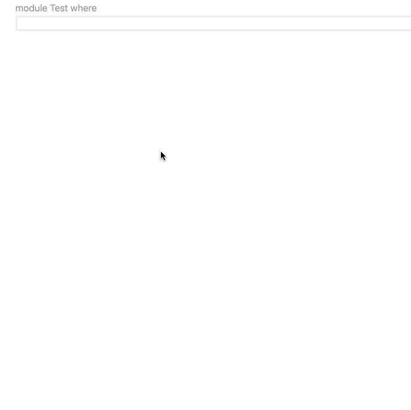

# Features

This table gives a summary of the features that HLS supports.
Many of these are standard LSP features, but a lot of special features are provided as [code actions](#code-actions) and [code lenses](#code-lenses).

| Feature                                             | [LSP method](./what-is-hls.md#lsp-terminology)                                                    |
| --------------------------------------------------- | ------------------------------------------------------------------------------------------------- |
| [Diagnostics](#diagnostics)                         | `textDocument/publishDiagnostics`                                                                 |
| [Hovers](#hovers)                                   | `textDocument/hover`                                                                              |
| [Jump to definition](#jump-to-definition)           | `textDocument/definition`                                                                         |
| [Jump to type definition](#jump-to-type-definition) | `textDocument/typeDefinition`                                                                     |
| [Find references](#find-references)                 | `textDocument/references`                                                                         |
| [Completions](#completions)                         | `textDocument/completion`                                                                         |
| [Formatting](#formatting)                           | `textDocument/formatting`, `textDocument/rangeFormatting`                                         |
| [Document symbols](#document-symbols)               | `textDocument/documentSymbol`                                                                     |
| [Workspace symbols](#workspace-symbols)             | `workspace/symbol`                                                                                |
| [Call hierarchy](#call-hierarchy)                   | `textDocument/prepareCallHierarchy`, `callHierarchy/incomingCalls`, `callHierarchy/outgoingCalls` |
| [Highlight references](#highlight-references)       | `textDocument/documentHighlight`                                                                  |
| [Code actions](#code-actions)                       | `textDocument/codeAction`                                                                         |
| [Code lenses](#code-lenses)                         | `textDocument/codeLens`                                                                           |
| [Selection range](#selection-range)                 | `textDocument/selectionRange`                                                                     |
| [Rename](#rename)                                   | `textDocument/rename`                                                                             |
| [Semantic tokens](#semantic-tokens)                 | `textDocument/semanticTokens/full`                                                                |

The individual sections below also identify which [HLS plugin](./what-is-hls.md#hls-plugins) is responsible for providing the given functionality, which is useful if you want to raise an issue report or contribute!
Additionally, not all plugins are supported on all versions of GHC, see the [plugin support page](./support/plugin-support.md) for details.

## Diagnostics

### GHC compiler errors and warnings

Provided by: `ghcide`

Provides errors and warnings from GHC as diagnostics.

### Hlint hints

Provided by: `hls-hlint-plugin`

Provides hlint hints as diagnostics.

### Stan hints

Provided by: `hls-stan-plugin`

Provides Stan hints as diagnostics.

### Cabal parse errors and warnings

Provided by: `hls-cabal-plugin`

Provides errors and warnings from Cabal as diagnostics

## Hovers

Provided by: `ghcide`

Type information and documentation on hover, [including from local definitions](./configuration.md#how-to-show-local-documentation-on-hover).

### Show fixity

Provided by: `hls-explicit-fixity-plugin`

Provides fixity information.

## Jump to definition

Provided by: `ghcide`

Jump to the definition of a name.

Known limitations:

- Only works for [local definitions](https://github.com/haskell/haskell-language-server/issues/708).

## Jump to type definition

Provided by: `ghcide`

Known limitations:

- Only works for [local definitions](https://github.com/haskell/haskell-language-server/issues/708).

## Jump to implementation

Provided by: `ghcide`

Jump to the implementation instance of a type class method.

Known limitations:

- Only works for [local definitions](https://github.com/haskell/haskell-language-server/issues/708).

## Jump to note definition

Provided by: `hls-notes-plugin`

Jump to the definition of a [GHC-style note](https://gitlab.haskell.org/ghc/ghc/-/wikis/commentary/coding-style#2-using-notes).

## Find references

Provided by: `ghcide`

Find references to a name within the project.

## Completions

### Code completions

Provided by: `ghcide`

- Completion of names from qualified imports.
- Completion of names from non-imported modules.

### Pragma completions

Provided by: `hls-pragmas-plugin`

Completions for language pragmas.

## Formatting

Format your code with various Haskell code formatters.
The default Haskell code formatter is `ormolu`, and the Haskell formatter can be configured via the `formattingProvider` option.

| Formatter       | Provided by                  |
| --------------- | ---------------------------- |
| Floskell        | `hls-floskell-plugin`        |
| Fourmolu        | `hls-fourmolu-plugin`        |
| Ormolu          | `hls-ormolu-plugin`          |
| Stylish Haskell | `hls-stylish-haskell-plugin` |

---

Format your cabal files with a cabal code formatter.
The default cabal code formatter is `cabal-gild`, which needs to be available on the `$PATH`,
or the location needs to be explicitly provided.
To change the cabal formatter, edit the `cabalFormattingProvider` option.

| Formatter       | Provided by                  |
|-----------------|------------------------------|
| cabal-fmt       | `hls-cabal-fmt-plugin`       |
| cabal-gild      | `hls-cabal-gild-plugin`      |

## Document symbols

Provided by: `ghcide`

Provides listing of the symbols defined in a module, used to power outline displays.

## Workspace symbols

Provided by: `ghcide`

Provides listing of the symbols defined in the project, used to power searches.

## Call hierarchy

Provided by: `hls-call-hierarchy-plugin`

Shows ingoing and outgoing calls for a function.

## Highlight references

Provided by: `ghcide`

Highlights references to a name in a document.

## Code actions

### Insert missing pragmas

Provided by: `hls-pragma-plugin`

Code action kind: `quickfix`

Inserts missing pragmas needed by GHC.

### Apply Hlint fixes

Provided by: `hls-hlint-plugin`

Code action kind: `quickfix`

Applies hints, either individually or for the whole file.
Uses [apply-refact](https://github.com/mpickering/apply-refact).

Known limitations:

- May have strange behaviour in files with CPP, since `apply-refact` does not support CPP.
- The `hlint` executable by default turns on many extensions when parsing a file because it is not certain about the exact extensions that apply to the file (they may come from project files). This differs from HLS which uses only the extensions the file needs to parse the file. Hence it is possible for the `hlint` executable to report a parse error on a file, but the `hlint` plugin to work just fine on the same file. This does mean that the turning on/off of extensions in the hlint config may be ignored by the `hlint` plugin.
- Hlint restrictions do not work (yet). This [PR](https://github.com/ndmitchell/hlint/pull/1340) should enable that functionality, but this requires a newer version of hlint to be used in HLS.

### Make import lists fully explicit

Provided by: `hls-explicit-imports-plugin`

Code action kind: `quickfix.literals.style`

Make import lists fully explicit (same as the code lens).

### Refine import

Provided by: `hls-explicit-imports-plugin`

Code action kind: `quickfix.import.refine`

Refines imports to more specific modules when names are re-exported (same as the code lens).

### Qualify imported names

Provided by: `hls-qualify-imported-names-plugin`

Code action kind: `quickfix`

Rewrites imported names to be qualified.

For usage see the [readme](https://github.com/haskell/haskell-language-server/blob/master/plugins/hls-qualify-imported-names-plugin/README.md).

### Add missing class methods

Provided by: `hls-class-plugin`

Code action kind: `quickfix`

Adds placeholders for missing class methods in a class instance definition.

### Unfold definition

Provided by: `hls-retrie-plugin`

Code action kind: `refactor.extract`

Extracts a definition from the code.

### Fold definition

Provided by: `hls-retrie-plugin`

Code action kind: `refactor.inline`

Inlines a definition from the code.

### Insert contents of Template Haskell splice

Provided by: `hls-splice-plugin`

Code action kind: `refactor.rewrite`

Evaluates a Template Haskell splice and inserts the resulting code in its place.

### Convert numbers to alternative formats

Provided by: `hls-alternate-number-format-plugin`

Code action kind: `quickfix.literals.style`

Converts numeric literals to different formats.

### Change Type Signature

Provided by: `hls-change-type-signature-plugin`

Code action kind: `quickfix`

Change/Update a type signature to match implementation.

Status: Until GHC 9.4, the implementation is ad-hoc and relies on GHC error messages to create a new signature. Not all GHC error messages are supported.

Known Limitations:

- Not all GHC error messages are supported
- Top-level and Function-local bindings with the same names can cause issues, such as incorrect signature changes or no code actions available.

[Link to Docs](https://github.com/haskell/haskell-language-server/blob/master/plugins/hls-change-type-signature-plugin/README.md)

### Add argument to function

Provided by: `hls-refactor-plugin`

Code action kind: `quickfix`

Add an undefined variable as an argument to the top-level binding.

### Convert to GADT syntax

Provided by: `hls-gadt-plugin`

Code action kind: `refactor.rewrite`

Convert a datatype to GADT syntax.

[Link to Docs](https://github.com/haskell/haskell-language-server/blob/master/plugins/hls-gadt-plugin/README.md)

### Expand record wildcard

Provided by: `hls-explicit-record-fields-plugin`

Code action kind: `refactor.rewrite`

Expand record wildcards, explicitly listing all record fields as field puns.

### Unknown SPDX License suggestion

Provided by: `hls-cabal-plugin`

Code action kind: `quickfix`

Correct common misspelling of SPDX Licenses such as `BSD-3-Clause`.

### Add dependency to `cabal` file

Provided by: `hls-cabal-plugin`

Code action kind: `quickfix`

Add a missing package dependency to your `.cabal` file.

## Code lenses

### Add type signature

Provided by: `ghcide`

Shows the type signature for bindings without type signatures, and adds it with a click.

### Evaluation code snippets in comments

Provided by: `hls-eval-plugin`

Evaluates code blocks in comments with a click.  A code action is also provided. [Tutorial](https://github.com/haskell/haskell-language-server/blob/master/plugins/hls-eval-plugin/README.md).

Known limitations:

- Standard input is shared with HLS, so e.g. [`getLine` breaks the connection to server](https://github.com/haskell/haskell-language-server/issues/2913).
- Standard (error) output [is not captured](https://github.com/haskell/haskell-language-server/issues/1977).
- While similar to [doctest](https://hackage.haskell.org/package/doctest), some of its features are unsupported,
  see [Differences with doctest](https://github.com/haskell/haskell-language-server/blob/master/plugins/hls-eval-plugin/README.md#differences-with-doctest).

### Make import lists fully explicit code lens

Provided by: `hls-explicit-imports-plugin`

Shows fully explicit import lists and rewrites them with a click (same as the code action).

### Refine import code lens

Provided by: `hls-explicit-imports-plugin`

Shows refined imports and applies them with a click (same as the code action).

### Fix module names

Provided by: `hls-module-name-plugin`

Shows module name matching file path, and applies it with a click.

## Selection range

Provided by: `hls-code-range-plugin`

Provides haskell specific
[shrink/expand selection](https://code.visualstudio.com/docs/editor/codebasics#_shrinkexpand-selection)
support.

## Folding range

Provided by: `hls-code-range-plugin`

Provides haskell specific
[Folding](https://code.visualstudio.com/docs/editor/codebasics#_folding)
support.

## Rename

Provided by: `hls-rename-plugin`

Provides renaming of symbols within a module. Experimental cross-module renaming can be enabled via the configuration.

Known limitations:

- Cross-module renaming requires all components to be indexed, which sometimes causes [partial renames in multi-component projects](https://github.com/haskell/haskell-language-server/issues/2193).

## Semantic tokens

Provided by: `hls-semantic-tokens-plugin`

Provides semantic tokens for each token in the source code to support semantic highlighting.

## Rewrite to overloaded record syntax

Provided by: `hls-overloaded-record-dot-plugin`

Code action kind: `refactor.rewrite`

Rewrites record selectors to use overloaded dot syntax

## Missing features

The following features are supported by the LSP specification but not implemented in HLS.
Contributions welcome!

| Feature                | Status            | [LSP method](./what-is-hls.md#lsp-terminology) |
| ---------------------- | ----------------- | ---------------------------------------------- |
| Signature help         | Unimplemented     | `textDocument/signatureHelp`                   |
| Jump to declaration    | Unclear if useful | `textDocument/declaration`                     |
| Jump to implementation | Unclear if useful | `textDocument/implementation`                  |
| Linked editing         | Unimplemented     | `textDocument/linkedEditingRange`              |
| Document links         | Unimplemented     | `textDocument/documentLink`                    |
| Document color         | Unclear if useful | `textDocument/documentColor`                   |
| Color presentation     | Unclear if useful | `textDocument/colorPresentation`               |
| Monikers               | Unclear if useful | `textDocument/moniker`                         |
