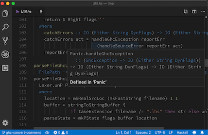

# `hie-core` (Haskell IDE engine)

Our vision is that you should build an IDE by combining:




* [`hie-bios`](https://github.com/mpickering/hie-bios) for determining where your files are, what are their dependencies, what extensions are enabled and so on;
* `hie-core` (i.e. this library) for defining how to type check, when to type check, and producing diagnostic messages;
* A bunch of plugins that haven't yet been written, e.g. [`hie-hlint`](https://github.com/ndmitchell/hlint) and [`hie-ormolu`](https://github.com/tweag/ormolu), to choose which features you want;
* [`haskell-lsp`](https://github.com/alanz/haskell-lsp) for sending those messages to a [Language Server Protocol (LSP)](https://microsoft.github.io/language-server-protocol/) server;
* An extension for your editor. We provide a [VS Code extension](https://code.visualstudio.com/api) as `extension` in this directory, although the components work in other LSP editors too (see below for instructions using Emacs).

There are more details about our approach [in this blog post](https://4ta.uk/p/shaking-up-the-ide).

## Using it

### Install `hie-core`

First install the `hie-core` binary using `stack` or `cabal`, e.g.

1. `git clone https://github.com/digital-asset/daml.git`
2. `cd daml/compiler/hie-core`
3. `cabal install` or `stack install` (and make sure `~/.local/bin` is on your `$PATH`)

It's important that `hie-core` is compiled with the same compiler you use to build your projects.

### Test `hie-core`

Next, check that `hie-core` is capable of loading your code. Change to the project directory and run `hie-core`, which will try and load everything using the same code as the IDE, but in a way that's much easier to understand. For example, taking the example of [`shake`](https://github.com/ndmitchell/shake), running `hie-core` gives some error messages and warnings before reporting at the end:

```
Files that worked: 152
Files that failed: 6
 * .\model\Main.hs
 * .\model\Model.hs
 * .\model\Test.hs
 * .\model\Util.hs
 * .\output\docs\Main.hs
 * .\output\docs\Part_Architecture_md.hs
Done
```

Of the 158 files in Shake, as of this moment, 152 can be loaded by the IDE, but 6 can't (error messages for the reasons they can't be loaded are given earlier). The failing files are all prototype work or test output, meaning I can confidently use Shake.

The `hie-core` executable mostly relies on [`hie-bios`](https://github.com/mpickering/hie-bios) to do the difficult work of setting up your GHC environment. If it doesn't work, see [the `hie-bios` manual](https://github.com/mpickering/hie-bios#readme) to get it working. My default fallback is to figure it out by hand and create a `direct` style [`hie.yaml`](https://github.com/ndmitchell/shake/blob/master/hie.yaml) listing the command line arguments to load the project.

Once you have got `hie-core` working outside the editor, the next step is to pick which editor to integrate with.

### Using with VS Code

Install the VS code extension (see https://code.visualstudio.com/docs/setup/mac for details on adding `code` to your `$PATH`):

1. `cd compiler/hie-core/extension`
2. `npm ci`
3. `npm install vsce --global` (may require `sudo`)
4. `vsce package`
5. `code --install-extension hie-core-0.0.1.vsix`

Now openning a `.hs` file should work with `hie-core`.

### Using with Emacs

If you don't already have [MELPA](https://melpa.org/#/) package installation configured, visit MELPA [getting started](https://melpa.org/#/getting-started) page to get set up. Then, install [`use-package`](https://melpa.org/#/use-package). Finally, add the following lines to your `.emacs`.
```elisp
;; LSP
(use-package flycheck
  :ensure t
  :init
  (global-flycheck-mode t))
(use-package yasnippet
  :ensure t)
(use-package lsp-mode
  :ensure t
  :hook (haskell-mode . lsp)
  :commands lsp)
(use-package lsp-ui
  :ensure t
  :commands lsp-ui-mode)
(use-package lsp-haskell
 :ensure t
 :config
 (setq lsp-haskell-process-path-hie "hie-core")
 (setq lsp-haskell-process-args-hie '())
 ;; Comment/uncomment this line to see interactions between lsp client/server.
 ;;(setq lsp-log-io t)
)
```

### Using with Vim/Neovim

#### LanguageClient-neovim
Install [LanguageClient-neovim](https://github.com/autozimu/LanguageClient-neovim)

Add this to your vim config:
```vim
let g:LanguageClient_rootMarkers = ['*.cabal', 'stack.yaml']
let g:LanguageClient_serverCommands = {
    \ 'rust': ['rls'],
    \ 'haskell': ['hie-core', '--lsp'],
    \ }
```

Refer to `:he LanguageClient` for more details on usage and configuration.

#### vim-lsp
Install [vim-lsp](https://github.com/prabirshrestha/vim-lsp).

Add this to your vim config:

```vim
au User lsp_setup call lsp#register_server({
    \ 'name': 'hie-core',
    \ 'cmd': {server_info->['/your/path/to/hie-core', '--lsp']},
    \ 'whitelist': ['haskell'],
    \ })
```

To verify it works move your cursor over a symbol and run `:LspHover`.
