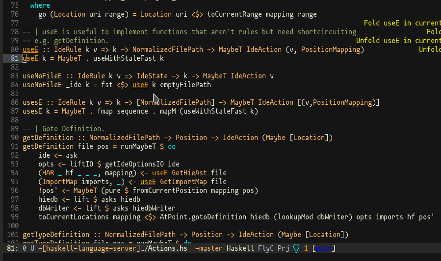

# Call hierarchy plugin for the [Haskell Language Server](https://github.com/haskell/haskell-language-server#readme)

The call hierarchy plugin can review the code to determine where functions are called and how they relate to other functions.

This plugin is useful when debugging and refactoring code because it allows you to see how different parts of the code are related. And it is more conducive for users to quickly understand their macro architecture in the face of strange code.

## Demo




## Prerequisite
None. You can experience the whole feature without any setting.

## Configuration
Enabled by default. You can disable it in your editor settings whenever you like.

```json
{
  "haskell.plugin.callHierarchy.globalOn": true
}

## Change log
### 1.0.1.0
- Support call hierarchy on type signatures.

## Acknowledgments
Supported by

* [Google Summer of Code](https://summerofcode.withgoogle.com/)
* Warm and timely help from mentors [@jneira](https://github.com/jneira) and [@pepeiborra](https://github.com/pepeiborra)
