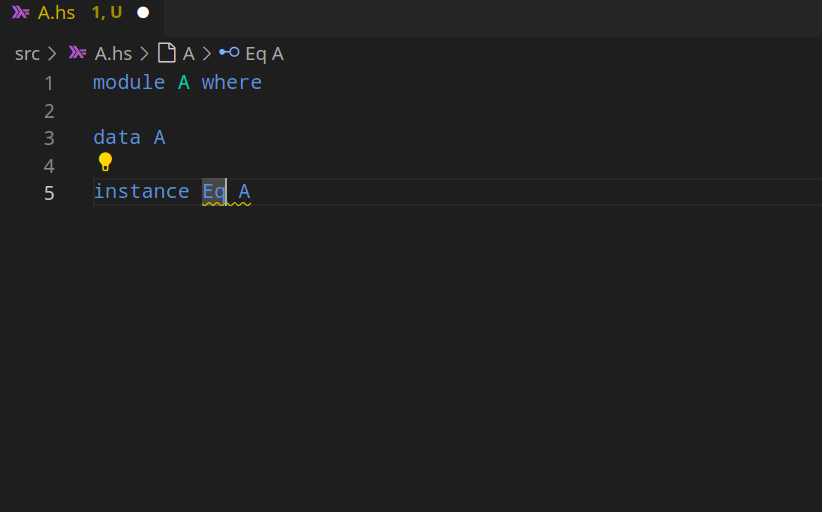
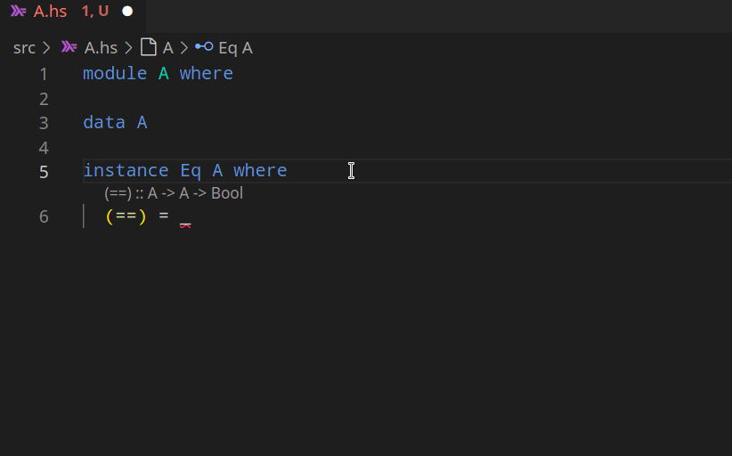

# Class Plugin

The class plugin provides handy operations about class, includes:

1. Code action to add minimal class definition methods.
2. Type lens about missing type signatures for instance methods.

## Demo

