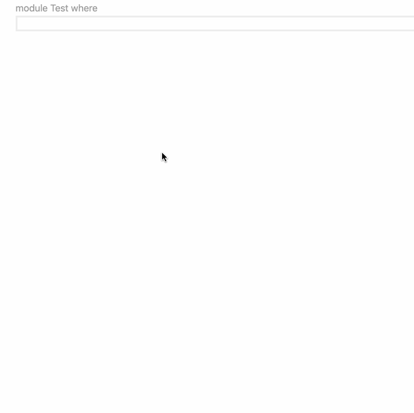

# Eval plugin for the [Haskell Language Server](https://github.com/haskell/haskell-language-server#readme)

The Eval plugin evaluates code inserted in comments.

This is mainly useful to test and document functions and to quickly evaluate small expressions.

Every line of code to be evaluated is introduced by __>>>__

A quick calculation:

```
-- >>> 2**4.5/pi
-- 7.202530529256849
```

A little test for the `double` function:

```
{- |
A doubling function.

>>> double 11
22
-}
double = (2*)
```

# Demo



# Test Structure

A test is composed by a sequence of contiguous lines, the result of their evaluation is inserted after the test body:

```
>>> "AB" ++ "CD"
>>> "CD" ++ "AB"
"ABCD"
"CDAB"
```

You execute a test by clicking on the _Evaluate_ code lens that appears above it (or _Refresh_, if the test has been run previously).

All tests in the same comment block are executed together.


Tests can appear in all kind of comments:
* plain comments (both single and multi line)
```
{-
>>> "ab" ++ "c"
"abc"
-}

-- >>> "ab" ++ "c"
-- "abc"
```
* Haddock commands (both single and multi line, forward and backward)
```
{-
>>> "ab" ++ "c"
"abc"
-}

-- >>> "ab" ++ "c"
-- "abc"

double a = a + a
-- ^ A doubling function
-- >>> double 11
-- 22
```

Modules that use CPP and Literate Haskell (Bird-style only) modules are also supported (for GHC >= 8.8).

# Test Components

In general, a test is a sequence of:
* imports
* directives
* statements
* expressions
* properties

in no particular order, with every line introduced by __>>>__ (or __prop>__ in the case of properties).

### Imports

```
>>> import Data.List
>>> import GHC.TypeNats
```

From any package in scope but currently NOT from modules in the same source directory.

### Language Extensions

```
>>> :set -XScopedTypeVariables -XStandaloneDeriving -XDataKinds -XTypeOperators -XExplicitNamespaces
```

### Statements and Declarations

Function declarations (optionally introduced by __let__):

```
>>> let tuple x = (x,x)
>>> let one=1;two=2
>>> triple x = (x,x,x)
```

Any other declaration:

```
>>> data TertiumDatur = Truly | Falsely | Other deriving Show
>>> class Display a where display :: a -> String
>>> instance Display TertiumDatur where display = show
```

Definitions are available to following tests in the __same__ comment:

```
{-
>>> two = 2

>>> two
2
-}

-- >>> two
-- Variable not in scope: two
```

If you want definitions to be available to all tests in the module, define a setup section:

```
-- $setup
-- >>> eleven = 11

{-
eleven is now available to any test:

>>> eleven*2
22
-}
```


### Type and Kind directives

```
>>> :type Truly
Truly :: TertiumDatur

>>> :kind TertiumDatur
TertiumDatur :: *

>>> :type 3
3 :: forall p. Num p => p

>>> :type +d 3
3 :: Integer

>>> type N = 1
>>> type M = 40
>>> :kind! N + M + 1
N + M + 1 :: Nat
= 42
```

### Expressions

```
>>> tuple 2
>>> triple 3
>>> display Other
(2,2)
(3,3,3)
"Other"
```

IO expressions can also be evaluated but their output to stdout/stderr is NOT captured:

```
>>> print "foo"
()
```

### Properties

```
prop> \(l::[Int]) -> reverse (reverse l) == l
+++ OK, passed 100 tests.
```

# Haddock vs Plain Comments

There is a conceptual difference between Haddock and plain comments:
* Haddock comments constitute the external module's documentation, they state the contract between the implementor and the module users (API)
* Plain comments are internal documentation meant to explain how the code works (implementation).

This conceptual difference is reflected in the way tests results are refreshed by the Eval plugin.

Say that we have defined a `double` function as:

```
double = (*2)
```

And, in an Haddock comment, we run the test:

```
{- |
>>> double 11
22
-}
```

We then change the definition to:

```
double = (*3)
```

When we refresh the test, its current result is compared with the previous one and differences are displayed (as they change the API):

```
{- |
>>> double 11
WAS 22
NOW 33
-}
```

On the contrary, if the test were into a plain comment, the result would simply be replaced:

```
{-
>>> double 11
33
-}
```

If you find this WAS/NOW behaviour does not fit your needs, you can turn it off with toggling the configuration option:
```json
"haskell.plugin.eval.config.diff": false
```

# Multiline Output

By default, the output of every expression is returned as a single line.

This is a problem if you want, for example, to pretty print a value (in this case using the [pretty-simple](https://hackage.haskell.org/package/pretty-simple) package):

```
>>> import Text.Pretty.Simple
>>> pShowNoColor [1..3]
"[ 1\n, 2\n, 3\n]"
```

We could try to print the pretty-print output, but stdout is not captured so we get just a ():

```
>>> print $ pShowNoColor [1..7]
()
```

To display it properly, we can exploit the fact that the output of an error is displayed as a multi-line text:

```
>>> import qualified Data.Text.Lazy as TL
>>> import Text.Pretty.Simple
>>> prettyPrint v = error (TL.unpack $ pShowNoColor v) :: IO String
>>> prettyPrint [1..3]
[ 1
, 2
, 3
]
```

This assumes you did not turn on exception marking (see [Marking exceptions](#marking-exceptions) below).

# Differences with doctest

Though the Eval plugin functionality is quite similar to that of [doctest](https://hackage.haskell.org/package/doctest), some doctest's features are not supported.

### Capturing Stdout

Only the value of an IO expression is spliced in, not its output:

```
>>> print "foo"
()
```

###  Marking exceptions

When an exception is thrown it is not prefixed:

```
>>> 1 `div` 0
divide by zero
```

If you want to get the doctest/GHCi behaviour, you can toggle the configuration option:
```json
"haskell.plugin.eval.config.exception": true
```
```
>>> 1 `div` 0
*** Exception: divide by zero
```

### Pattern Matching

The arbitrary content matcher __...__ is unsupported.

### Missing lambda abstractions in property tests

Variables are not automatically introduced:

```
prop> reverse (reverse l) == (l::[Int])
Variable not in scope: l :: [Int]
```

This works:

```
prop> \(l::[Int]) -> reverse (reverse l) == l
+++ OK, passed 100 tests.
```

### Multiline Expressions

Multiline expressions are not supported, see https://github.com/haskell/haskell-language-server/issues/1817

# Acknowledgments

Design/features derived from:

* [GHCi](https://downloads.haskell.org/~ghc/latest/docs/html/users_guide/ghci.html)

* [Haddock's](https://www.haskell.org/haddock/doc/html/ch03s08.html#idm140354810775744) Examples and Properties

* [Doctest](https://hackage.haskell.org/package/doctest)

* the REPLoid feature of [Dante](https://github.com/jyp/dante)

